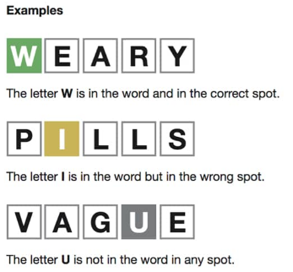
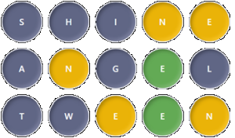

# Wordleを解いてみよう

ヒューリスティックプログラミングの練習

---

# はじめに
- Wordleとは、米NewYork Times誌のサイトで公開されている単語当てクイズです。
- 今回は、Wordleを解くプログラムを組んでみます。
- 後半10分で10連戦を行い、最優秀者には粗品を進呈します。

- サンプル格納場所：\\matsusaka\open\40_全社\あ\アルゴリズム勉強会@0973\20_サンプルソース\wordle

---

# Wordleのルール

- 5文字の単語を推測します。
- 1問につき6回までトライできます。
- 緑はその文字が位置も含めて正しいことを表します。
- 黄色は単語にその文字を含むが、位置が正しくないことを表します。
- 灰色は単語にその文字が含まれないことを表します。

---
# 解いてみたい
- Twitterとかで流行ってるので解いてみたい。
- でも英単語とか苦手分野…
- そうだ！プログラミングだ！
- というわけで、今回はこれを解くプログラムを作っていきます。
- 本家は1日1回チャレンジ可能、という制約があるため、今回は以下のクローンを使います。
https://octokatherine.github.io/word-master/

---

# サンプルプログラムの説明

- 英語辞書ファイル同梱です(dic.txt)
- 入力はテキストファイル(input.txt)
- 1行目に緑の文字列
- 2行目に灰色文字を1行に
- 3行目以降に黄色入力を複数行
- 標準出力に候補リストを出力します

--- 

# さぁ解いてみましょう

- 17:15～17:25の間に、作成したプログラムを用いて、実際に10回解いて点数を申告してください。
- 完全にプログラム一致での解法ではなく、自力／目視での英単語解読も可とします。
- 17:00時点で次のヒントに移ります。

---

# 解読率を高めるための工夫の1例(17:00)

- 当たりやすい単語を優先的にリストアップさせたい。
- 利用率の高い文字による評価
- 英単語では、s,e,a,等が頻出なので評価が高い。
- 文字毎の出現位置による評価
- 末尾にe、後ろから2文字目にh,kは有意に多い。

---

# 解読率を高めるための実装例(17:00)

- 事前に辞書を一度解析して、出現位置／頻度をカウントしておく
- よく使われる文字をスコア順に並べておいて、e:26,a:25,...q:1みたいに強さを表現
- 単語の頻出度合いを測って、リストをソートする。（earth→e:26+a:25+...みたいに）
- 更に出現位置も加味してポイント化→評価してみる。
